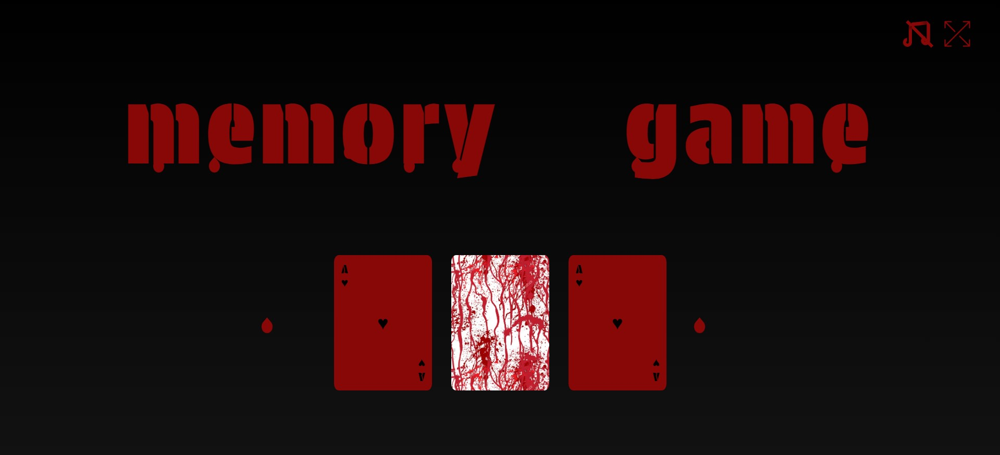

# [Horror Memory Game](https://horror-memorygame.netlify.app/)
***

***  
## Technical description  
- Project is done with **Vite** as a development environment tool. I've decided to use it instead of **Webpack** (which I had been using in my previous React based projects), even though in a small project like this I think it would make no difference in terms of speed.  
- _React + TypeScript + SCSS_ Modules was a perfect combination for my purposes here. The project is small and I believe it's not difficult to navigate around, in any case there are 2 main folders _-pages-_ and _-components-_ which are pretty much self-explanatory.  
- _NOTE:_ The game is not fully responsive since I put more emphasis on design & game functionality and I didn't want to waste much time to perfectly fit all devices.  
***  
## Game description  
  **Functionalities**:  
- Press 'F' key to enter/exit fullscreen
- Press _note_ icon in upper right corner to play/stop song (there are 3 songs which are played randomly)  
***
**SPOILER ALERT**:  
List below is a set of instructions on how to get to the memory game through few steps  
Fot those who don't want to explore by themselves, here is a set of steps on how to get to memory game part.  
1. On Home page, hover the middle card and click exactly on word Play to get to the next page
2. Hover over the red bat 